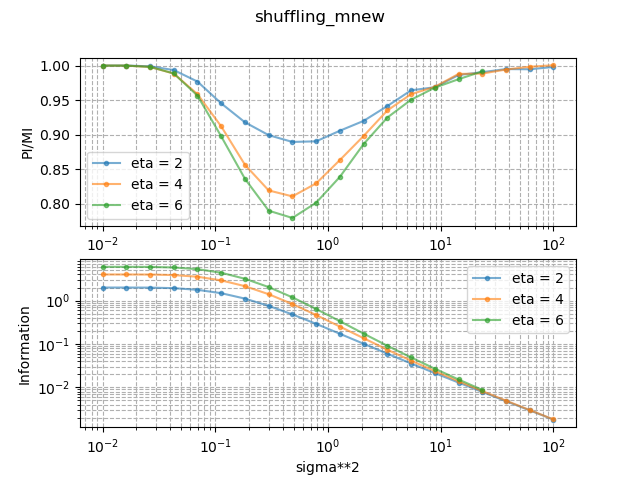
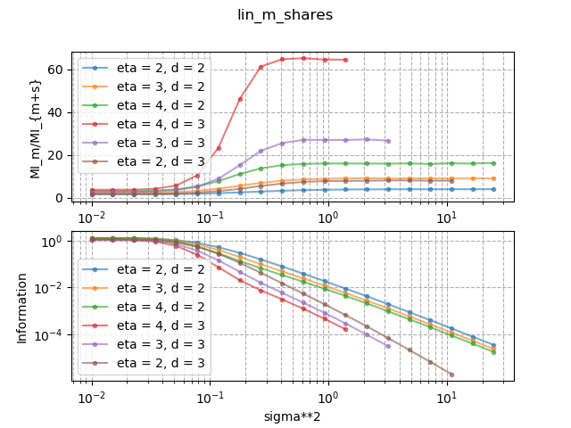

# Overview 
This project contains the software used to generate the figures in Section 3 and Section 4 of the manuscript "_Bitslice Masking and Improved Shuffling: How and When to Mix Them in Software?_" presented at TCHES2022. 

## Masking and Shuffling strategies
Next we describe how the figures from Section 4 are obtained. For each investigated algorithm, it computes the mutual information between the secret $`\bm{A}`$ and the leakage $`\bm{Y}`$ for a masking only implementation $`\mathsf{MI}_m`$ and the masked and shuffled implementation $`\mathsf{MI}_{m+s}`$. This is done by first generating leakage for an implementation and then computing the true PDF ($`\mathsf{f}(\bm{l};a)`$). To do so, we use two different methods.

The first method is to precompute all the possible deterministic parts of the leakage by considering all the possible combinations of randomness used by the algorithm. Each combination of randomness is called a mode. The leakage $`\bm{l}`$ is then generated by selecting a mode and adding Gaussian noise. Then $`\mathsf{f}(\bm{l};a)`$ is computed by comparing all modes to $`\bm{l}`$ with a Gaussian model and summing all of them (e.g., Eq. 9 in the manuscript). This is done for the algorithms:
1. **_Linear layer shuffling all_** from Algorithm 5
2. **_ISW shuffling tuples_** from Algorithm 6
3. **_ISW shuffling shares_** from Algorithm 7

This can be expensive depending on the parameters of the algorithm. The second option is to use the fast Walsh-Hadamard transform in order to reduce the complexity of the evaluation of $`\mathsf{f}(\bm{l};a)`$. It allows not summing over all the modes. This is not applicable to all the algorithms and is only used for:
1. **_Linear layer shuffling tuples_** from Algorithm 3
2. **_Linear layer shuffling shares_** from Algorithm 5

### Computationally efficient attacks
Next, we describe how figures from Section 3 are produced. It first generates leakage from a shuffled implementation (i.e.g, Algorithm 2) and then computes the mutual information thanks to Equation 9. It also computes the perceived information for both models from AC12 and our new proposal. 


# Install
The tool is using a Python3 front-end while the sampling is handled by a custom Rust package. This code has been tested on various Linux distributions. No support is provided for other operating systems. We recommand to install Python3 (>= 3.6) with your package manager (e.g., apt-get). 

In order to install the required Python3 dependencies, you can run
```
python3 -m pip install --user -r requirements.txt
```
Next, we detail how to install Rust, compile the library and if desired uninstall Rust toolchain. 
The instructions are taken from [rustup.rs](https://rustup.rs/). First run (without root privilege) the command
```
curl --proto '=https' --tlsv1.2 -sSf https://sh.rustup.rs | sh
```
and follow the instructions. We recommend to use all the default parameters. The project has been tested to toolchain `1.58.0`. To use it, run
```
rustup toolchain install 1.58.0
rustup default 1.58.0 
```
Now you can build the custom library by running
```
cd sampling && cargo build --release && cd - && ln -s sampling/target/release/libsampling.so sampling.so
```
You should be able to run our package. Enjoy ! The library is fetched by `main.py` by using the symlink [sampling.so](sampling.so). If you want, you can uninstall Rust by running
```
rustup self uninstall
```

# Usage 
Next we will describe how to use the package by describing its backup strategy, inputs and how to plot the results. 

### IT analyses
For the information theoretic analysis, two files do some computations. The first one is [gen_modes.py](gen_modes.py) and generates all the possible modes for an implementation. The second one is [proba_estimator.rs](sampling/src/proba_estimator.rs) that samples the algorithm distribution and compute the $`\mathsf{MI}`$. In order to interact with these files, the user must run [main.py](main.py) thanks to: 
```
python3 main.py
```
In that file, there are several parameters that the user can change:
```
stds = np.logspace(np.log10(0.1),np.log10(5),20) 
stds_unpro = np.logspace(np.log10(0.1),np.log10(10),20) 
timeout_sec = 60*60 #4*3600
precision = .5E-2
precision_unpro = .2E-2

#tuples (eta,D,precision,timeout,stds)
run = [ # Equation 13 against Algorithm 2
        ("shuffling_mnew", [(2,),(4,),(6,)], precision_unpro, timeout_sec,stds_unpro),
        # Equation 12 against Algorithm 2
        ("shuffling_mac12",[(2,),(4,),(6,)], precision_unpro, timeout_sec,stds_unpro),
        # Algorithm 3
        ("lin_m_tuples",[(2,2),(3,2),(4,2),(2,3)],precision,timeout_sec,stds),
        # Algorithm 4
        ("lin_m_shares",[(2,2),(3,2),(4,2),(2,3)],precision,timeout_sec,stds),
        # Algorithm 5
        ("linear_shu_everything",[(2,2),(2,3),(3,2)],precision,timeout_sec,stds),
        # Algorithm 6
        ("isw_shu_tuples",[(2,2)],precision,timeout_sec,stds),
        # Algorithm 7
        ("isw_shu_shares",[(2,2)],precision,timeout_sec,stds)]

```
Next, we describe them:
- `precision`: is the precision of a single $`\mathsf{MI}`$ estimator that we denote $`\mathsf{\hat{MI}}`$. More precisely, it samples the leakage until the ratio $` \mathsf{\hat{MI}}/ std(\mathsf{\hat{MI}})`$ is smaller than `precision`.
- `timeout_sec`: is the timeout (in seconds) after which the sampling will stop. If the sampling is not precise enough, no value will be returned and the user is asked to increase `timeout_sec`.
- `run`: is a list of tuples where the first element corresponds to an algorithm to sample. The second argument is a list of parameters to the algorithm. This first parameter is $`\eta`$ and the second one is $`d`$. The following data in the tuples are respectively the timeout, the precision and the noise levels to test. The comments point to the corresponding algorithm / adversary in the manuscript.

There is a tradeoff between `precision` and `timeout_sec`. Indeed, the more precise the $`\mathsf{\hat{MI}}`$ is, the more time it requires to be computed. 
 
### Saving results
For the backups, we use [joblib](https://joblib.readthedocs.io/en/latest/memory.html) which allows to cache previous computations (in `./cache/`). Once a point on the curves (i.e., fixed $`\sigma^2`$) has been successfully computed for a given algorithm, this computation will be skipped when the same point is required (e.g., when rerunning the software). Once an entire curve has been computed, or that it timed out, the result is saved in  [data/](data/) in the `.npz` format. All the available points in `.cache/` can be converted into the `.npz` files by running `main.py` with a small timeout (i.e., .1).

We note that the package is doing estimation by sampling which can be expensive. In [data/](data/), we provide the resulting output of running the package with a timeout up to 4 hours on a 24 cores machine. 

### Display results
In order to plot the data stored in `.npz` files, you can simply run:
```
python3 plot_results.py
```
All the data should be displayed in a popup window. All the figures are also stored in [figs/](./figs/). As an example, we show next resulting plots for both evaluating an adversarial strategy (Section 3) and a shuffling configuration (Section 4).

| Adversaries (Section 3) | Shuffling+Masking config (Section 4) |
| ------ | ------ |
|  |  |

# License
This project is licensed under `GNU AFFERO GENERAL PUBLIC LICENSE, Version 3`.
See `COPYING` for more information.
